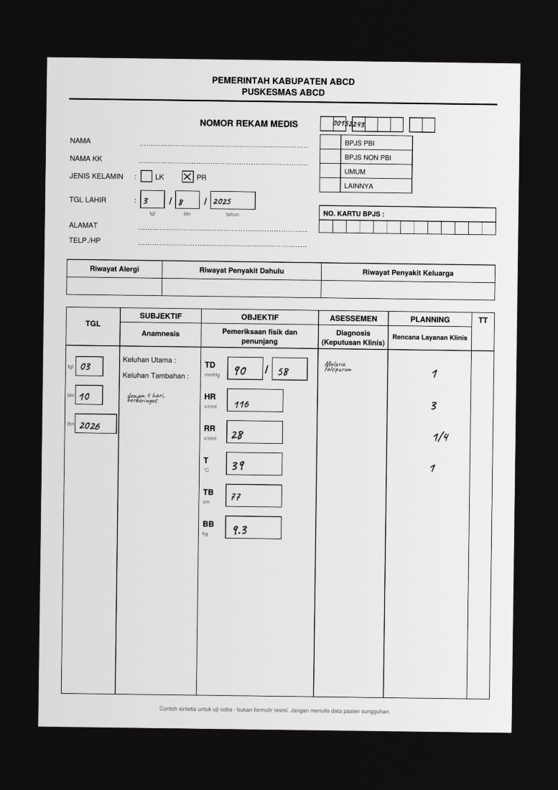

# HONAI

*AI-based health information bridging and clinical decision support*

**Health Information Bridge and Clinical Decision Support AI**: a phone tool that reads handwritten clinical records offline and checks them against a reviewed guideline, with a person in charge of every decision.
Built for the Hack-Nation x World Bank Small AI for Development hackathon 2026 (health track), by one person. Referral code: WBGSmallAIGADS.

**Designed for any clinic and, by design, any disease. Piloted on two: child nutritional status and malaria dosing, using Indonesian data and guidelines.** Only these two are implemented.

> **Because of HONAI, a primary-care nurse or doctor will turn a handwritten medical record into a checked nutritional status and a guideline dose check in seconds, at the bedside, with no signal, that they would otherwise leave on paper or re-type late. We know because on `[UPDATE: N]` test pages the app read `[UPDATE: x of y]` values correctly and flagged the one it could not be sure of.**

**Try it:** `[UPDATE: demo URL]` · in English: `[UPDATE: demo URL]?lang=en` · the **ID | EN** button in the header switches at any time.



## The problem
A child's malaria dose depends on weight, and weight and nutritional status are written by hand on a paper record. Malaria caused an estimated 597,000 deaths worldwide in 2023, mostly children under five (WHO). In Indonesia, the pilot country, there were 706,297 malaria cases in 2025 and about 1 in 5 children under five were stunted in 2023 (Kemenkes). Health facilities in Indonesia were required to go electronic by the end of 2023, yet small studies still describe double recording, manual records kept alive because the local system fails, and network and training gaps. Sources and the gaps in them: [docs/DATA_CARD.md](docs/DATA_CARD.md).

## What it does (one photo)
1. **Photograph** the handwritten record on a phone. It works offline, in airplane mode.
2. **A small OCR model reads the boxes on the phone** (record number, sex tick, dates, vitals, five prescription rows). Each box is read four times and the readings are voted.
3. **A person confirms**, with a picture of the handwriting beside every reading. Doubtful values are yellow, disagreeing readings are left blank with candidates to choose from, and weight and height are checked against age while confirming.
4. **Nutritional status** (WHO 2006 standards, Indonesian categories, 0 to 59 months).
5. **Malaria dose check** against the Indonesian national pocketbook. Result: "matches", "differs", or "cannot check, ask a doctor". Every finding quotes the page, section and exact sentence.
6. **Save and export** two CSV files: a link file (record number and date of birth, for the clinic) and an analysis file (neither, for sharing). The patient's name never leaves the paper.

## Why AI, and why not a spreadsheet
A spreadsheet can store a record but cannot read it off paper, so the record is re-typed or not typed. The AI does **one thing**: it reads handwriting, on the device, from a download of 49.6 MB. Everything after reading is plain, checkable rules: WHO tables and a guideline pack with exact quotes. There is no generated text, so nothing is made up.

## Guardrails (human in the loop, not-sure fail-safe)
- A person confirms every value and the prescription. The tool never acts on its own.
- A value is "reliable" only when at least 3 of 4 independent readings agree. Otherwise no value is filled in.
- Not sure means ask a person: unreadable drug names must be chosen, an unusual weight blocks confirmation until checked, an uncertain weight stops the dose check, a malaria type that cannot be read must be chosen or marked unknown, and a pack missing any citation refuses to load.
- The guideline pack is labelled **DRAFT** on screen until a clinician has reviewed every line.
- Name, address, phone and BPJS number are discarded at read time and cannot be exported (a test plants fake names and fails if any appears).

## Evidence (honest)
| Level | What | Result |
|---|---|---|
| Logic | More than 1,000 automated checks, including the WHO tables against an independent library (356 cross-checks, 33 boundaries) and 75 dose-check tests | All pass (`npm test`) |
| Real phone, real browser model | `[UPDATE: N]` pages of invented children, written on a tablet, photographed from the screen | `[UPDATE: x of y]` values correct, no value shown as reliable was wrong, the one wrong value was flagged |
| Synthetic photos (form v3) | 21 invented pages, handwriting-style fonts, read by a different OCR engine | Regression evidence only. See "Technical README" |
| Speed and size | One phone | Ready offline in 19 s, photo to confirmation 7 s (form v3 build), 49.6 MB one-time download. `[UPDATE: v4 timing]` |

## Limits (read these)
**Only two diseases are implemented**, and only one country's guidelines. All children are invented and the writer is the developer: not real patients, not real paper, few handwritings. Nutritional status covers 0 to 59 months only. The dose check covers DHP, primaquine and artesunate only, and a match is not proof that a dose is right. The malaria tables are a draft until reviewed. The record number is typed by a person when it is not read reliably. The photo stays in the phone gallery until deleted. Full list: [docs/DATA_CARD.md](docs/DATA_CARD.md).

## Local language
Every screen is in **Bahasa Indonesia** by default (for clinic staff) and has an **English switch** (ID | EN button, or `?lang=en`). The guideline quotes stay in the original Indonesian, labelled as such, and the CSV exports are identical in both languages. How it would fare in a less-supported language: reading digits and Latin-script drug names does not depend on the spoken language, and a language is one dictionary (English took about 359 entries, with tests that list any untranslated string). The English nutrition and dose wording needs a doctor's review: [docs/EN_MEDICAL_REVIEW.md](docs/EN_MEDICAL_REVIEW.md). Voice is not built. See [docs/JUDGE_QA.md](docs/JUDGE_QA.md).

## Reuse and what happens next
To add a disease: a reviewed guideline pack; for threshold-style rules the repository has a rule language that cannot run code (built and tested, not yet wired to the screen); for table-based dosing, a small checker module as for malaria. A form template generator makes a second form a description, not new reading code. Next: a consented pilot, a multi-writer timing test against typing, a barcode sticker for the record number, WHO 2007 tables for ages 5 to 18, a second guideline pack to prove the any-disease design, then other languages and voice.

## Tech stack
Vite PWA, vanilla JavaScript, IndexedDB. PaddleOCR PP-OCR models through `ppu-paddle-ocr` and ONNX Runtime Web (WASM). WHO LMS tables. Guideline pack as JSON built from the pocketbook text. Vitest. Deployed on Vercel.

## Documents
[Data card](docs/DATA_CARD.md) · [Video script](docs/VIDEO_SCRIPT.md) · [Judge Q&A](docs/JUDGE_QA.md) · [English wording review](docs/EN_MEDICAL_REVIEW.md) · [Technical README](#technical-readme)

---

## Technical README

An offline-first web app (PWA) for primary-care clinics (in the pilot, Indonesian puskesmas). A health worker photographs a handwritten paper medical record; the app reads the numbers **on the phone**, shows each
number next to a picture of the handwriting for a person to confirm, then:

1. computes the child's **nutritional status** (WHO 2006 standards, Permenkes 2/2020 categories, 0–59 months),
2. offers an optional **malaria dose check**: the dose that was written is compared with the table in the national malaria pocketbook, and every finding shows its page, section and exact quote,
3. saves the record on the phone and exports a **CSV** that says how every value was obtained (read and confirmed, chosen from a candidate, corrected, or typed).

It does not diagnose, prescribe or generate advice. It works without internet after the first load. No server, no cloud, no patient data leaves the phone unless the user exports a CSV.

Built for the World Bank / Hack-Nation Small AI for Development hackathon 2026 (health track). **All forms and children in this repository are synthetic.**

## The flow
1. **Photo of the page** (camera or gallery; a photo of a tablet screen works too). The whole page must be visible.
2. The app finds the printed words (30 of them) to work out how the page is tilted, then cuts out the boxes: record number (MRN), sex tick boxes (LK / PR), date of birth, the TGL date, six vitals boxes (TD, HR, RR, T, TB, BB) and **five prescription rows** (a free-text drug name and three boxes each: tablets per dose, times per day, days).
3. Each numeric box is read **four times** (the whole-page reading plus three crops at different sizes) and the readings are voted. Four agree: shown as reliable. A tie or a lone reading: no value is offered, the candidates are shown and a person chooses.
4. **Empty rows** are not read: a row counts as used only if a quick read of the whole row finds text (or the ink is very strong), because glare and moire on a screen photo look like ink. The **drug name** of each used row is read as text and matched to a fixed list (DHP, dihidroartemisinin-piperakuin, primakuin, primaquine, PQ, artesunat; known other drugs such as paracetamol are recognised and ignored); empty rows are skipped without reading. A "1" written without a flag often comes back as a slash: in the number boxes "/" is read as 1 and "//2" as 1/2, always as a guess that a person confirms. While the popup is open, weight and height are checked against the age live: an implausible pair blocks "Konfirmasi" until the value is changed or the person ticks "this value is really correct". The malaria type must be chosen (or "tidak diketahui") when a DHP or primaquine row exists. A dropdown per row lets a person confirm or change the drug; an unrecognised name must be chosen, never guessed. **Tablets per day = tablets per dose x times per day.** The free text of **Asessemen** and **Planning** is read three times each; the malaria type (falsiparum, tropika, tersiana, vivaks, mix, ...), the RDT result, the word "dispersibel" and the artesunate mg are picked out from a fixed word list (a letter or two wrong is tolerated) and voted. Unclear means blank, never guessed.
5. **Popup:** every box next to a picture of the handwriting. Date of birth and TGL give the age live. The sex comes from the tick boxes and is never guessed when both or neither are ticked. The prescription is shown beside the pictures and needs one tap, "Sesuai tulisan", before anything is saved.
6. **Result:** nutritional status (0-59 months), flags, and the malaria dose check, which **runs by itself** on the confirmed prescription. Children of 5-18 years get the dose check but not nutrition (stage 2, below).
7. **Save and export** (two files, below). Records stay in IndexedDB on the phone.

## Privacy by design
- **Name, family-head name, address, phone and BPJS number stay on paper.** The page reader sees the whole page for a moment on the phone, so right after the page is aligned **every piece of text inside those areas is thrown away**. A test plants fake names there and fails if they show up on any screen, in any saved record or in either export file (`tests/ui_privacy.test.js`).
- **Two export files with fixed column lists** (`src/csv.js`; a test fails if a column is added without changing the expected list, and if any column looks like a name, address, phone, BPJS, ID or raw-text column):
  - **Link file:** MRN (as 00-1234-56 so a spreadsheet keeps the leading zeros) + date of birth + exact visit date. For the clinic's own system. Personal health data: keep it inside the clinic.
  - **Analysis file:** no MRN, no date of birth, visit month instead of the exact date, age in months. This is the one to share with evaluators.
- **MRN + date of birth is the ID key.** Saving the same MRN with a different date of birth warns ("check the MRN or the date of birth": a misread digit points at someone else); the same MRN and visit date twice warns about a duplicate. Both need the "I checked" tick.
- **Honest limits:** MRN + date + sex is pseudonymous, not anonymous. The photo itself stays in the phone's gallery unless deleted (an in-app camera, or a fold-over flap over the name block, would fix that). UU PDP 27/2022 treats health data as specific personal data: have legal confirm what applies.

## The medical record form v4 (`public/forms/rekam-medis-contoh.pdf`, SYNTHETIC)
Based on the layout of a paper SOAP record (TGL, SUBJEKTIF, OBJEKTIF, ASSESMENT, PLANNING, TT). Changes made for reading: Agama and Pekerjaan removed; LK/PR as tick boxes; date of birth boxes; a wider TGL column with date boxes; six labelled boxes in the Objektif column; **one wide box for the record number; five prescription rows in the Planning column (a name box plus tablets per dose, times per day, days).** v4 replaced v3's four fixed DHP/primaquine boxes so that any drug can be written and the frequency is explicit (this also makes the once-daily DHP warning reliable). The Planning column is wider and Subjektif narrower.
History: v1 had had eight tiny digit boxes for the MRN and free text for the prescription. On synthetic photos the digits were right and reliable only 45% of the time, and free-text amounts only 5 of 18. Boxes read much better. The template (`src/templates/medical-record.js`) is generated from the same description that draws the PDF (`scripts/make_form.py`), so the picture and the template cannot disagree. A different real form needs its own template.

## Age and dates (`src/recorddate.js`)
Age is the visit date (TGL) minus the date of birth, in completed months. The app refuses impossible dates (30 February), a visit before the birth, a visit date later than today on the phone, and ages over 18 years, each with a reason. 0-59 months get nutrition; 5-18 years get the dose check only.

## Nutritional status (`src/core/zscore.js`)
WHO 2006 LMS tables. Under 24 months: length (lying) tables, weight-for-length. From 24 months: height (standing) tables, weight-for-height. Index names switch (PB/U to TB/U, BB/PB to BB/TB).
The category is taken from the score rounded to 2 decimals, the number shown on screen. **Stage 2 (5-18 years)** needs the WHO 2007 reference tables (height-for-age and BMI-for-age 5-19 years, weight-for-age 5-10 years) and the Permenkes 2/2020 category labels for that age; not installed.

## Malaria dose check (`src/malaria.js`, `public/guidelines/malaria-dose.json`)
The dose that was written is compared with the guideline table for the child's weight (Buku Saku Tata Laksana Kasus Malaria). It runs on the confirmed prescription; every field can still be changed.
- **Output:** "matches the table", "differs from the table", "cannot check, ask a doctor", or "nothing to compare", then findings. Each finding shows the table row or sentence it rests on, with page, section and exact quote.
- **Compares:** DHP amount and days by weight band; primaquine amount, days by species, none for P. malariae and P. knowlesi, none under 6 months, none in pregnancy, none while breastfeeding an infant under 6 months, none with G6PD deficiency; artesunate mg/kg (3 under 20 kg, 2.4 above); a negative test with an ACT recorded; dispersible tablets below 5 kg and 6 months; DHP written more than once a day.
- **Fail-safes:** an uncertain weight stops the check; a weight outside the table is "cannot check"; exactly 20 kg is "not sure" because the guideline does not say; matching days alone is never reported as a verified dose; a missing primaquine is a note (it can be deliberate); a pack without a citation for every table and statement is refused whole.
- **Nutrition link:** BB/TB "Obesitas" adds the guideline's note to dose by ideal body weight (Catatan c).
- **Not covered:** artemether-lumefantrine, artesunate-pyronaridine, quinine, relapse dosing, the special G6PD dose (quoted, not calculated), dosing in pregnancy, diagnosis and follow-up, malnutrition, tablet strength in mg (not in the source file).
- **Authoring:** `npm run build-malaria-pack` builds the pack from `docs/source/Malaria_clean.md`. The pack is a **DRAFT** (`reviewedBy: null`) until a clinician has checked every line of `docs/malaria-dose-verification.csv` against the PDF. Page numbers are inferred from the page markers in the .md; the publication year (2023) is a guess.

## Reading the prescription (`src/rxrows.js`, `src/rxparse.js`, `src/fieldparse.js`)
Shorthand understood: tablets per day = times a day x amount, so 1x1, 1x2, 1x3, 1x4, 1x5, 1x1/2, 1 dd 1, "1/2 tab 1x1", "2 tablet sehari selama 3 hari", "14 hari", fractions as 1/2, 1/4, 1 1/2, 1,5 or the glyphs. DHP written 3x1 (three times a day) still counts as 3 tablets per day but adds a warning, because DHP is once daily. An amount with no frequency, an amount that is not on the tablet list, two different numbers, or a type word with a typo that could be another word ("malaria" must never become "malariae") all stay blank. The matched handwriting text is shown on screen only and is never saved; only the parsed fields are.

## Evidence so far (all SYNTHETIC, **form v3**; archived: v4 has no synthetic accuracy numbers yet, only the logic tests below, and its evidence will come from real pages)
21 invented children (`docs/case-sheet.json`), written in handwriting-style fonts by three simulated writers on form v3, then degraded like a photo of a tablet screen (tilt, perspective, glare, moire-like banding, blur, noise, JPEG) at three difficulty levels. A real OCR engine (RapidOCR in Python; **not** the browser model) read them.
- **Alignment:** 21 of 21 sheets (at least 28 of 30 labels used); box centres within 1% of a box width on average, 3.2% at worst; the true centre of all 378 boxes inside the rectangle that is cut out.
- **Reading, 378 boxes, voted:** 312 right and shown as reliable, 18 right but flagged, 44 no value (a person types it), **3 wrong and not flagged** (a lone "1" read as "7" three times by the crops: a weight of 18.1 read as 78.1, a visit day, and a primaquine day). The weight error is caught later because 78 kg at 50 months fails the plausibility check and forces the "I checked" tick.
- **By group:** vitals 138 of 147 right and reliable; dates 105 of 126; prescription amounts 69 of 84; sex ticks 21 of 21.
- **Record number: 0 of 21 read as a reliable 8-digit number.** The OCR garbles the leading "00" (readings like "1A0-1126-48"). So the MRN is typed by a person with the picture and the raw readings beside it. This is the weakest and most important field; the date-of-birth cross-check is what catches a wrong one later. A barcode or QR sticker with the MRN would read far better and is the recommended next step.
- **Prescription, end to end (amounts from boxes, type and test from text):** every field right on 4 of 21 pages. The dose check run on the pre-filled values gave the **same result as with perfect reading on 13 of 21 pages**, a different but not reassuring result on 8 (a blank field, so "cannot check" or "nothing to compare"), **0 false reassurances and 0 false alarms**. Malaria type: 12 of 18 right, 6 left blank, 0 wrong.
- **What this does not show:** real handwriting, real photos, the browser model, or real clinics. It shows the logic works, fails safe, and where it is weak. The real test is the pages written on a tablet and photographed with the phone (`docs/case-sheet-answer-key.csv` is the key).

## Dose and nutrition logic tests
- Calculator: 52 hand-built cases, 356 cross-checks for 24-59 months against an independent reference library, 33 category boundaries, the age switch at 24 months, table limits.
- Dose check: 71 tests; tables checked against amounts typed by hand from the source, every weight-band boundary, a sweep of every band x species x formulation (prescribing exactly the table is never flagged), wrong doses, infants, pregnancy, G6PD, severe malaria, the refusal rules.
- Field parsers (tablets box, MRN): 43 tests, including slashes for 1 and 11/2. Prescription reader: 85 tests (free-text shorthand for the Asessemen/Planning words). Prescription rows (form v4): 50 (drug names, tablets per day, assembling, conflicts). Exports: 11. Record reader (form v4): 26 and screen tests: 18 scenarios in a simulated browser, both with a **scripted** fake camera and engine (they test wiring and logic, not handwriting; the real-OCR synthetic evidence below is for form v3).
- Breaking the table amounts, the band-boundary rule, the infant primaquine rule, the visit-before-birth check, the tick threshold, the 24-month switch, the sex boxes, the privacy filter, the analysis file columns, the "matches" rule or the fraction parser makes tests fail.

## Known limits
- **Not tested on a real phone** with the real browser OCR model and real handwriting. Do this before claiming any accuracy: `/ocr-spike.html`, then pages of your own (below).
- **Real pages so far (form v4, 6 pages, 66 values, read on a phone by the real browser model):** 65 correct; 47 needed no touch, 12 were flagged but right, 4 chosen from candidates, 3 edited; the one wrong value (a weight) was flagged by the app and accepted by the person, which the live weight/height check now blocks. Dose check: 4 of 6 as expected, 2 failed safe, 0 false reassurances. MRN read reliably on 3 of 5 pages. Small sample: report counts, not percentages.
- Reading depends on the box layout of this form; a real form needs a template and its own check.
- The record number is typed by a person (see above). The prescription needs one tap of confirmation by design: a misread dose that happens to match the table would otherwise say "matches" falsely, and people accept about 1 in 5 wrong AI suggestions.
- A dose that matches the table is not proof that the dose is right for that child.
- The malaria tables are a DRAFT until reviewed; the nutrition tables for 5-18 years are not installed.
- Plausible ranges for the vitals boxes (`src/templates/medical-record.js`) are placeholders for a clinician to confirm.
- iPhone Safari may clear stored data after about a week without use: export often.
- Size of the reading model: measure it from the build and put the number in the data card.
- The interface is in Bahasa Indonesia only for now; an EN/ID switch is planned.

## Test with your own pages (the evidence that matters)
1. Open `public/forms/rekam-medis-contoh.pdf` (form v4) on a tablet; copy children from the case sheet PDF (or invent your own, including an invented record number) into the form, one per page, different writers if possible. Never use real patient data.
2. Photograph each page with the phone (a tablet screen is fine: medium brightness, avoid glare).
3. For each page note: seconds from photo to popup (measured on form v3: 7 s on the second photo, 19 s to become offline-ready, model plus runtime 49.6 MB), how many boxes had to be corrected (count the typed MRN as one), whether the dose card was filled right without changes, and whether a wrong value went through unflagged.
4. Compare with the time to type the same values. That comparison is what shows whether the AI step is worth having.

## Run on your computer
    npm install
    npm run dev          # opens a local link (not offline yet)
    npm test             # calculator tests, app tests, screen tests

## Build and publish
    npm run build        # makes the dist/ folder
Connect the GitHub repo to Vercel (framework: Vite). Vercel builds and gives you an HTTPS link.

## Test offline on a phone (Gate 0)
1. Open the Vercel link on the phone (internet on). Wait for the green banner "Siap offline".
2. iPhone: Share > Add to Home Screen. Android: Install app.
3. Switch on airplane mode. Open the icon. The app must open and calculate.
4. Save a record, close the app, open it again: the record must still be there.

## OCR test page (engine check)
`/ocr-spike.html` loads a small open OCR model inside the browser, reads one photo, and shows what it found and how long it took.
After reading, it maps every piece to a column and month (`src/mapping.js`), using the printed "Ideal"/"Aktual" words and month numbers as position markers, and straightens tilted photos. It can then read one row (one sex, one month) the way the app will, with a picture of each cell next to the reading so a person can check by eye.
Before the first build, run once:

    npm install
    npm run setup-ocr    # copies the WebAssembly files and downloads the model files into public/ (about 14 MB + models)

`npm run build` runs this step automatically, so Vercel fetches the model files while building (the build needs internet).
The files in `public/ort` and `public/models` are not committed to GitHub; they are rebuilt each time.
If a download fails, the script says which file and where to get it by hand.

`vercel.json` sets two headers (Cross-Origin-Opener-Policy and Cross-Origin-Embedder-Policy) so the OCR can use several processor threads.
If the site ever fails to load anything from another address, delete `vercel.json` and redeploy.


## What is where
```
src/core/zscore.js            WHO LMS calculator, 0-59 months
src/core/who_lms.js           WHO tables (generated once)
src/templates/medical-record.js  the blank form v3 as data (generated from scripts/make_form.py)
src/rxparse.js                prescription and diagnosis words -> fields (fixed word list, voting, never guesses)
src/fieldparse.js             parsers for the MRN and the fraction boxes
src/clinic.js                 page alignment (printed words -> camera transform) and box rectangles
src/readcell.js               per-box voting, ink detection, tick boxes
src/session.js                readRecordPage / readRecordFields
src/recorddate.js             dates and age checks
src/recordchecks.js           plain consistency checks on the vitals
src/malaria.js                dose pack validation and the comparison
src/views.js                  popup and result HTML (Bahasa Indonesia)
src/main.js                   screen logic
src/csv.js, storage.js        export, IndexedDB
public/guidelines/malaria-dose.json   the reviewed dose pack (DRAFT)
public/forms/rekam-medis-contoh.pdf   the synthetic form
docs/                         case sheet, answer key, verification sheet, source markdown, sample photo
scripts/                      pack builder, verification sheet, case sheet, form, evidence generators
tests/                        all tests; tests/fixtures holds real OCR output of the synthetic photos
```
Older modules (Buku KIA growth page, the clinic sheet, the generic guideline rule engine) stay in the repository with their tests but are no longer on the screen.
